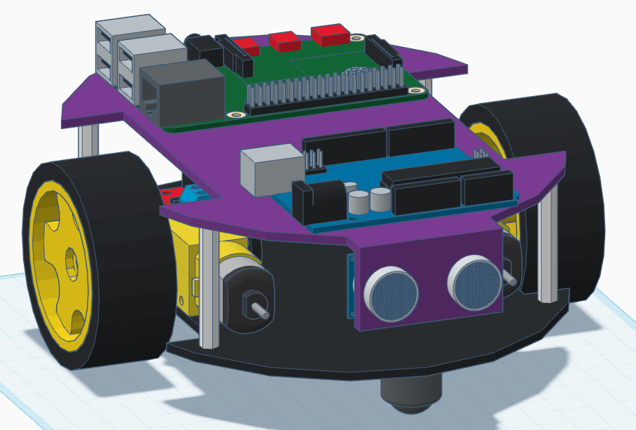

# LIDARino v0.1
This is the official repository of the Robot Programming subject in Artificial Intelligence and Robotics course at Sapienza University of Rome

to install rosserial we downloaded the zip and moved it to /usr/share/arduino/libraries

to use hector_mapping we followed point 7 of this tutorial https://yoraish.wordpress.com/2021/09/08/a-full-autonomous-stack-a-tutorial-ros-raspberry-pi-arduino-slam/ and modifing this config file in src/hector_slam/hector_mapping/launch/mapping_default.launch looking for 

to start the lidar run roslaunch ldlidar ld06.launch 