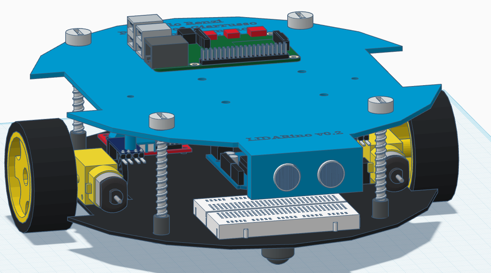
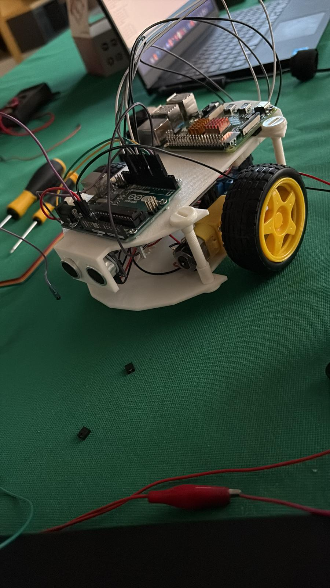

# LIDARino
This is the official repository of the Robot Programming subject in Artificial Intelligence and Robotics course at Sapienza University of Rome


# Project Structure 

```sh 
firmware
├── encoderWheel.cpp => Functions to read data from encoders
├── firmlib.h => header file for the whole firmware library 
├── firmware.ino => sketch that puts all the firmware together and that gets uploaded to the Arduino
├── Motors.cpp => Implementation of the class motors to control both motors
├── Motors.h => header file for the class motors to control both motors
├── ultrasound.cpp => Functions to request and read data from the ultrasound sensor
├── velocitiesCallback.cpp => Function that gets called when a new command from rosserial arrives
LIDARINO_WORKSPACE
├── build ...
├── devel ...
├── src
    ├── lidarino_pkg
        ├── config 
            ├── base_local_planner.yaml => local planner parameters
            ├── costmap_common.yaml => general costmap parameters
            ├── global_costmap.yaml => gloabal costmap parameters
            ├── local_costmap.yaml => local costmap parameters
        ├── launch
            ├── launch.launch => planning complete launcher
            ├── launch2.launch => everything except planning
            ├── launch2pi.launch => same as launch2 but no simulator map server to launch it separately
            ├── move_base.launch => only planning
            ├── pi.launch => same as launch2 but no simulator
            ├── Testing_Localization.launch => localization simulation
            ├── tfonly.launch => only tf nodes
        ├── maps
            ├── cappero_laser_odom_diag_2020-05-06-16-26-03.png => diag map
            ├── map.pgm => 1st configuration of the room
            ├── map.yml => yml file for the room map
            ├── map2.pgm => 2nd configuration of the room
            ├── map3.pgm => 3rd configuration of the room
            ├── sim_map.yaml => yaml file for the diag map
        ├── rviz
            ├── navigation.rviz => navigation package rviz configuration 
            ├── rviz_map_and_robot.rviz => rviz configuration for our localizer
        ├── src
            ├── dmap_localizer.cpp => implementation of a dmap based localizer 
            ├── localizer.cpp => node that uses the localizer to localize the robot in the map
            ├── simulation.cpp => simulation node to handle a virtual world with a map and robot with a lidar
            ├── odometry.cpp => node to do odometry based either on a simulated cmd_vel or the real one 
            ├── keyboard_interface.cpp => node to create a interface between the keyboard and the robot
            ├── pos_subscriber.cpp => node to test that the position is being published correctly
```


## INSTALLATION 

1. Clone the repository:  
 ```sh 
 git clone "https://github.com/cybernetic-m/LIDARino_robot"
 ```
2. Install rosserial on the Arduino IDE and on on ROS

3. open the firmware folder with Arduino IDE and upload it to your Arduino

4. Install the lidar ros package from the repo and follow the instructions in the doc folder of the repo
 ```sh 
 git clone "https://github.com/LetsOKdo/sdk_ld06_raspberry_ros"
 ```

5. (optional) follow point 7 of this tutorial https://yoraish.wordpress.com/2021/09/08/a-full-autonomous-stack-a-tutorial-ros-raspberry-pi-arduino-slam/ to install hector mapper to create a custom map

## LAUNCH

1. start the lidar 
 ```sh 
 cd sdk_ld06_raspberry_ros
 roslaunch ldlidar ld06.launch 
 ```

2. start our package in another terminal

 ```sh 
 cd LIDARino_robot/LIDARINO_WORKSPACE
 . ./devel/setup.bash
 roslaunch lidarino_pkg pi.launch
 ```

3. start rosserial on the raspberry side

 ```sh 
 rosrun rosserial_python serial_node.py /dev/ttyACM0
 ```

4. start the keyboard interface 

 ```sh 
 cd LIDARino_robot/LIDARINO_WORKSPACE
 . ./devel/setup.bash
 rosrun lidarino_pkg keyboard_interface
 ```

## HARDWARE

1. Arduino UNO

2. Raspberry PI

3. DUAL H-BRIDGE L298N

4. 2 TT motors 

5. Ultrasonic sensor HC-SR04

6. Breadboard

7. Power Bank for the Raspberry and separate battery for the motors (9V+ recommended ) 

## VERSIONS




[example](https://www.tinkercad.com/things/dUmpkYZLHeb-chassisupv02)

To design the base for our robot we started from a community shared base (https://www.tinkercad.com/things/daN7nNs5RfJ-line-follower-robot-v3) but modified it a lot to add wheel encoders, ultrasonic sensor, raspberry and a more secure mounting system for the motors and for the 2 bases. We also made it a bit bigger to fit all the new equipment.




From there we started to write the firmware on Arduino to read data from all the sensors and to control the motors, and we programmed it to be able to turn on it's axis


and go "straight"


But the space was still too little to fit everything comfortably without fear of disconnects, for example we had to fit the breadboard upside down which made the sensors not very reliable. To fix that we created a new version bigger still, so that we could leave the top for the lidar and raspberry only and fit Arduino and all the sensor and motor and their wiring in the bottom base, that made it so that we could control it better.


## Authors
Massimo Romano (2043836) (https://github.com/cybernetic-m) 

Paolo Renzi (1887793) (https://github.com/RenziPaolo)

Francesco Giarrusso (1807094) (https://github.com/fragiarrusso)
